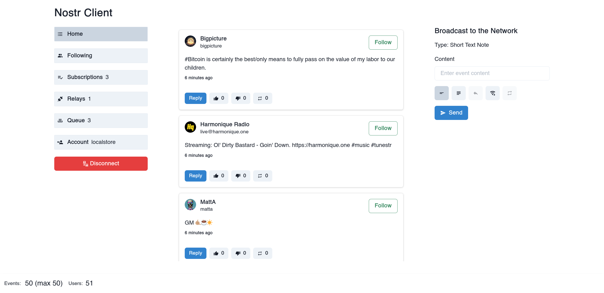

# Nostr Library and Clients

I wanted to learn more about Nostr, so I decided to implement libraries and clients.

- `./client`: node client example
- `./client-web`: react client example (`NWorker`, `RelayClient`, `NUser` React, Chakra, Zustand)
- `./relay-docker`: high-performance gnost-relay docker image for local testing
- `@nostr-ts/common`: `./packages/common`: common types and functions
- `@nostr-ts/node`: `./packages/node`: client for usage with node `ws` library
- `@nostr-ts/web`: `./packages/web`: client for usage with browser `WebSocket` API

If you want to know what I think about Nostr and how it compares to Mastodon, Matrix and others, checkout [this article](https://f-a.nz/gist/hello-nostr/).

### Preview of the web client

Nostr web client built with React.

- Relies on IndexedDB and local storage for data and accounts
- implements `@nostr-ts/common` and `@nostr-ts/web`

Initial support for `nos2x` and any other extention following NIP-07 is available.

A new, live version builds from master on every commit: [https://d2okqj4v2u9fts.cloudfront.net](https://d2okqj4v2u9fts.cloudfront.net).



## Highlights

- Supported NIP: 1, 2, 4, 10, 11, 13, 14, 18, 23, 25, 36, 39, 40, 42, 45, 56
- Partial NIP: 19, 32, 57
- `RelayClient` to handle websocket connection and message sending (node, web)
- `RelayDiscovery` to make it easy to pickup new relays (node)
- `NEvent` to assemble events (universal)
- `NFilters` to filter events (universal)
- `NUser` to handle user metadata (node, web - WIP)
- `NWorker` to handle client-side processing and database (web)
- `loadOrCreateKeypair` basic key handling (node, web)

The goal here is to make it as easy as possible to get started, so there's usually a convenience function for everything (NewShortTextNote, NewRecommendRelay, ...).

### Storage

- Sattelite CDN (web)

## Usage notes

On Node.js use:

```js
import { NewShortTextNote, NFilters } from "@nostr-ts/common";
import {
  RelayClient,
  RelayDiscovery,
  loadOrCreateKeypair,
  NUser,
} from "@nostr-ts/node";
```

install with:

```bash
# or npm install, or yarn install
pnpm install @nostr-ts/common @nostr-ts/node
```

In the browser use:

```js
import { NewShortTextNote, NFilters } from "@nostr-ts/common";
import { RelayClient, loadOrCreateKeypair, NUser } from "@nostr-ts/web";
```

install with:

```bash
# or npm install, or yarn install
pnpm install @nostr-ts/common @nostr-ts/web
```

So most types and utility functions comes from `@nostr-ts/common`, and anything related to file system, database or networking (requests), is in `@nostr-ts/node` and `@nostr-ts/web`.

### Install & Build

```bash
pnpm install -r
pnpm run build
```

The build command will take care of `./packages/*`.

## Features

- [x] NIP-1: [Basic protocol flow description](https://github.com/nostr-protocol/nips/blob/master/01.md)

**Generate a keypair** (Sign up):

```js
const keypair = await loadOrCreateKeypair("./key");
```

- This will look for a private key `./key` and a public key `./key.pub`
- If they don't exist, they will be generated and saved to disk
- If only the private key `./key` exists, a public key will be generated from it

**Connect to the network**:

```js
let client = new RelayClient([
  {
    url: "wss://nostr.rocks",
    read: true,
    write: true,
  },
  {
    url: "wss://nostr.lu.ke",
    read: true,
    write: true,
  },
]);
await client.getRelayInformation();
```

**Send a message**:

```js
const event = NewShortTextNote({ text: "Hello nostr!" });
event.signAndGenerateId(keypair);
client.sendEvent({ event });
```

**Receive messages**:

```js
const filters = new NFilters();
filters.addAuthor(keypair.pub);

client.subscribe({
  filters,
});

client.listen((payload) => {
  console.log(payload.meta.id, payload.meta.url);
  logRelayMessage(payload.data);
});
```

**Recommend a relay**

```js
const event = NewRecommendRelay({
  relayUrl: "wss://nostr.rocks",
});
event.signAndGenerateId(keypair);
client.sendEvent({ event });
```

**Supported messages (events)**

- `NewShortTextNote`: Send a short text note
- `NewLongFormContent`: Send a long form content note
- `NewShortTextNoteResponse`: Respond to a short text note
- `NewReaction`: React to a note (`+`, `-`)
- `NewQuoteRepost`: Repost a note
- `NewGenericRepost`: Report any event
- `NewUpdateUserMetadata`: Update user metadata (profile)
- `NewRecommendRelay`: Recommend a relay
- `NewReport`: Report an event or user
- `NewZapRequest`: Request a zap
- `NewSignedZapRequest`: Request a zap helper
- `NewZapReceipt`: Zap receipt
- `NewEventDeletion`: Delete an event

**Event**

You can manually assemble an event:

```js
const event = new NEvent({
   kind: NEVENT_KIND_SHORT_TEXT_NOTE,
   tags: [],
   content: 'Hello nostr!',
})

// These are all the options; you do not (and usually should not) use all of them
// If something doesn't add-up, these sometimes throw an error
event.addEventTag(...)
event.addPublicKeyTag(...)
event.addRelaysTag(...)
event.addEventCoordinatesTag(...)
event.addIdentifierTag(...)
event.addLnurlTag(...)
event.addAmountTag(...)
event.addKindTag(...)
event.addExpirationTag(...)
event.addSubjectTag(...)
event.addSubjectTag(makeSubjectResponse(subject));
event.addNonceTag(...)
event.addContentWarningTag(...)
event.addExternalIdentityClaimTag(...)
event.addReportTags(...)

// Add custom tags
event.addTag(['p', 'myvalue'])

// Mentions in event content; for ex. Checkout nostr:e21921600ecbcbea699a9f76c8156886bef112b71c4f79ce1b894386b5413466
event.mentionUsers([pubkey1, pubkey2])
event.hasMentions()

// Sign
event.signAndGenerateId(keypair)

// Ready to publish?
const ready = event.isReadyToPublish()

// Required NIP? [13, 39, 40]
const nip = event.determineRequiredNIP()

// Properties
event.hasPublicKeyTags()
event.hasRelaysTag()
event.hasEventCoordinatesTags()
event.hasIdentifierTags()
event.hasLnurlTags()
event.hasAmountTags()
event.hasExpirationTag()
event.hasSubjectTag()
event.hasNonceTag()
event.hasContentWarningTag()
event.hasExternalIdentityClaimTag()
event.hasReportTags()
```

- [x] NIP-2 [Contact List and Petnames](https://github.com/nostr-protocol/nips/blob/master/02.md)

```js
const event = NewContactList({
  contacts: [
    {
      key: "5276ac499c9c6a353634d3d2cb6f4ada5167c3b886108ab4ddeb8ddf7b0fff70",
      relayUrl: "wss://nostr.rocks",
      petname: "nostrop",
    },
  ],
});
```

- [x] NIP-4 [Encrypted Direct Message](https://github.com/nostr-protocol/nips/blob/master/04.md)

```js
const event = NewEncryptedPrivateMessage({
    text: "Let's make this secret plan happen!",
    recipientPubkey: "...",
});
const encEv = await encryptEvent(event, keypair);
event.content = encEv.content as string;
event.signAndGenerateId(keypair);
```

This is a bit ugly, as I did not want to include the encryption library in the common package.

Here's what it might looks like:

```js
import crypto from "crypto";
import { getSharedSecret } from "@noble/secp256k1";

export async function encryptEvent(
  event: EventBase,
  keyPair: {
    privateKey: string,
    publicKey: string,
  }
) {
  const recipientPublicKey = event.tags ? event.tags[0][1] : undefined;
  if (!recipientPublicKey) {
    throw new Error(
      "No recipient public key set. Did you use NewEncryptedPrivateMessage?"
    );
  }

  let sharedPoint = await getSharedSecret(
    keyPair.privateKey,
    "02" + recipientPublicKey
  );
  let sharedX = sharedPoint.slice(1, 33);

  let iv = crypto.randomFillSync(new Uint8Array(16));
  var cipher = crypto.createCipheriv("aes-256-cbc", Buffer.from(sharedX), iv);
  let encryptedMessage = cipher.update(event.content || "", "utf8", "base64");
  encryptedMessage += cipher.final("base64");
  let ivBase64 = Buffer.from(iv.buffer).toString("base64");

  event.content = encryptedMessage + "?iv=" + ivBase64;

  return event;
}
```

_Adapted from this example: [github.com/nostr-protocol/nips/blob/master/04](https://github.com/nostr-protocol/nips/blob/master/04.md)._

- [x] NIP-11 [Relay Information Document](https://github.com/nostr-protocol/nips/blob/master/11.md)

```js
const infos = await client.getRelayInformation();
```

Based on this information the client decides whether to publish to a rely:

```
neededNips [ 40 ]
supportedNips [
   1,  2,  4,  9, 11,
  12, 15, 16, 20, 22,
  28, 33
]
Event a04308c18a5f73b97be1f66fddba1741dd8dcf8a057701a2b4f1713d557ae384 not published to wss://nostr.wine because not all needed NIPS are supported.
```

- [x] NIP-13 [Proof of work](https://github.com/nostr-protocol/nips/blob/master/13.md)

```js
const difficulty = 28;
const event = NewShortTextNote({
  text: "Let's have a discussion about Bitcoin!",
});
event.pubkey = keypair.pub;
event.proofOfWork(difficulty);
event.sign();
```

If you need anything above ~20 bits and work in the browser, there's a helper function for web worker (`proofOfWork(event, bits)`):

```js
// pow-worker.ts
import { proofOfWork } from "@nostr-ts/common";

self.onmessage = function (e) {
  const data = e.data;
  const result = proofOfWork(data.event, data.bits);
  self.postMessage({ result });
};

// client.ts
return new Promise((resolve, reject) => {
  const worker = new Worker(new URL("./pow-worker.ts", import.meta.url), {
    type: "module",
  });

  // Setup an event listener to receive results from the worker
  worker.onmessage = function (e) {
    resolve(e.data.result);
    // Terminate the worker after receiving the result
    worker.terminate();
  };

  // Send a message to the worker to start the calculation
  worker.postMessage({
    event: event,
    bits: bits,
  });
});
```

- [x] NIP-14 [Subject tag in Text events](https://github.com/nostr-protocol/nips/blob/master/14.md)

```js
const event = NewShortTextNote({
  text: "Let's have a discussion about Bitcoin!",
});
event.addSubjectTag("All things Bitcoin");
```

If you want to respond to a note, keeping the subject:

```js
const inResponseTo = {
  id: "e21921600ecbcbea699a9f76c8156886bef112b71c4f79ce1b894386b5413466",
  pubkey: "5276ac499c9c6a353634d3d2cb6f4ada5167c3b886108ab4ddeb8ddf7b0fff70",
  created_at: 1690881792,
  kind: 1,
  tags: [["subject", "All things Bitcoin"]],
  content: "Let's have a discussion about Bitcoin!",
  sig: "6cee8c1d11ca5f8c7a0bd9839d0af5d3af3cc6a5de754fc449d34188c0066eee3e5b5b4e567cd77a2e0369f8c9525d60e064db175acd02d9c5374c3c0e912969",
};
const relayUrl = "wss://nostr.rocks";
const event = NewShortTextNoteResponse({
  text: "Sounds like a great idea. What do you think about the Lightning Network?",
  inResponseTo,
  relayUrl,
});
```

If this is the first response, we prepend the subject with `Re: ` automatically. So you'd be responding with subject `Re: All things Bitcoin`.

- [x] NIP-18 [Reposts](https://github.com/nostr-protocol/nips/blob/master/18.md)

```js
const inReponseTo = {
  id: "e21921600ecbcbea699a9f76c8156886bef112b71c4f79ce1b894386b5413466",
  pubkey: "5276ac499c9c6a353634d3d2cb6f4ada5167c3b886108ab4ddeb8ddf7b0fff70",
  created_at: 1690881792,
  kind: 1,
  tags: [],
  content:
    "Hello everyone! I am working on a new ts library for nostr. This is just a test.",
  sig: "6cee8c1d11ca5f8c7a0bd9839d0af5d3af3cc6a5de754fc449d34188c0066eee3e5b5b4e567cd77a2e0369f8c9525d60e064db175acd02d9c5374c3c0e912969",
};
const event = NewQuoteRepost({
  relayUrl: "https://nostr.rocks",
  inReponseTo,
});
event.signAndGenerateId(keypair);
client.sendEvent({ event });
```

You can also utilize `NewGenericRepost` to repost any kind of event.

- [x] NIP-19 [bech32-encoded entities](https://github.com/nostr-protocol/nips/blob/master/19.md)

There are some helpers to get you started:

- `encodeBech32(...)`
- `decodeBech32(...)`

Shortcuts to the above, for specific use cases:

- `bechEncodeProfile(pubkey, relayUrls)` (returns ex. `nprofile...`)
- `bechEncodePublicKey(pubkey)`
- `bechEncodePrivateKey(privkey)`
- `decodeNostrPublicKeyString(nostr:npub...)` (returns public key)
- `decodeNostrPrivateKeyString(nostr:nsec...)`
- `decodeNostrProfileString(nostr:nprofile...)`
- `encodeNostrString(prefix, tlvItems)` (returns ex. `nostr:npub...`)

Examples public keys:

```js
const src =
  "nostr:npub1kade5vf37snr4hv5hgstav6j5ygry6z09kkq0flp47p8cmeuz5zs7zz2an";
const resO1 = decodeNostrPublicKeyString(src);
// res = b75b9a3131f4263add94ba20beb352a11032684f2dac07a7e1af827c6f3c1505

const resO2 = decodeNostrUrl(src);
// res = [{ prefix: 'npub', tlvItems: [{ type: 0, value: "b75b9a3131f4263add94ba20beb352a11032684f2dac07a7e1af827c6f3c1505" }] }]
```

Example profile:

```js
const pubkey =
  "3bf0c63fcb93463407af97a5e5ee64fa883d107ef9e558472c4eb9aaaefa459d";
const relays = ["wss://r.x.com", "wss://djbas.sadkb.com"];
const res01 = bechEncodeProfile(pubkey, relays);
// res01 = nprofile1qqsrhuxx8l9ex335q7he0f09aej04zpazpl0ne2cgukyawd24mayt8gpp4mhxue69uhhytnc9e3k7mgpz4mhxue69uhkg6nzv9ejuumpv34kytnrdaksjlyr9p

const res02 = makeNostrProfileString(pubkey, relays);
// res02 = nostr:nprofile1qqsrhuxx8l9ex335q7he0f09aej04zpazpl0ne2cgukyawd24mayt8gpp4mhxue69uhhytnc9e3k7mgpz4mhxue69uhkg6nzv9ejuumpv34kytnrdaksjlyr9p
```

- [x] NIP-23 [Long-form Content](https://github.com/nostr-protocol/nips/blob/master/23.md)

```js
const event = NewLongFormContent({
  text: "This is a really long one. Like I mean, not your usual short note. This is a long one. I mean, really long. Like, really really long. Like, really really really long. Like, really really really really long. Like, really really really really really long. Like, really really really really really really long."
  isDraft: false,
  identifier: "really-really-really-long"
})
```

- [x] NIP-25: [Reactions](https://github.com/nostr-protocol/nips/blob/master/25.md)

```js
const event = NewReaction({
  text: "+",
  inResponseTo: {
    id: "e21921600ecbcbea699a9f76c8156886bef112b71c4f79ce1b894386b5413466",
    pubkey: "5276ac499c9c6a353634d3d2cb6f4ada5167c3b886108ab4ddeb8ddf7b0fff70",
  },
});

event.signAndGenerateId(keypair);
client.sendEvent({ event });
```

- [x] NIP-36 [Sensitive Content / Content Warning](https://github.com/nostr-protocol/nips/blob/master/36.md)

```js
const event = NewShortTextNote({
  text: "This is a test note with explicit language.",
});
event.addContentWarningTag("explicit language");
```

- [x] NIP-39 [External Identities in Profiles](https://github.com/nostr-protocol/nips/blob/master/39.md#nip-39)

```js
const githubClaim = new ExternalIdentityClaim({
  type: IDENTITY_CLAIM_TYPE.GITHUB,
  identity: "semisol",
  proof: "9721ce4ee4fceb91c9711ca2a6c9a5ab",
});

const event = NewUpdateUserMetadata({
  claims: [githubClaim],
  userMetadata: {
    name: "Semisol",
  },
});

event.signAndGenerateId(keypair);
client.sendEvent({ event });
```

- [x] NIP-40 [Expiration Timestamp](https://github.com/nostr-protocol/nips/blob/master/40.md)

```js
const event = NewShortTextNote({ text: "Meeting starts in 10 minutes ..." });
event.addExpirationTag(1690990889);
```

- [x] NIP-42 [Authentication of clients to relays](https://github.com/nostr-protocol/nips/blob/master/42.md)

As far as I understand, relays should send the auth challenge either on connection, or when required.
The relay I'm testing with (gnost-relay) sends it on connection.

Here's how you can respond to the challenge:

```js
const challenge = "abc";
const event = NewAuthEvent({
  relayUrl: "wss://nostr-ts.relay",
  challenge: challenge,
});
event.signAndGenerateId(keypair);
client.subscribe({
  type: CLIENT_MESSAGE_TYPE.AUTH,
  signedEvent: JSON.stringify(event.ToObj()),
});
```

- [x] NIP-56 [Reporting](https://github.com/nostr-protocol/nips/blob/master/56.md)

The `publicKey` usually refers to the user that is being reported.
If the report refers to another event, use the `eventId` too (for ex. spam, illegal, profanity, nudity).

Impersonation:

```js
const event = NewReport({
  publicKey: "5276ac499c9c6a353634d3d2cb6f4ada5167c3b886108ab4ddeb8ddf7b0fff70",
  kind: NREPORT_KIND.IMPERSONATION,
});
```

Spam:

```js
const event = NewReport({
  publicKey: "5276ac499c9c6a353634d3d2cb6f4ada5167c3b886108ab4ddeb8ddf7b0fff70",
  eventId: "e21921600ecbcbea699a9f76c8156886bef112b71c4f79ce1b894386b5413466",
  kind: NREPORT_KIND.SPAM,
  // optionally pass some text
  content: "This is spam",
});
```

- [x] NIP-57 [Lightning Zaps](https://github.com/nostr-protocol/nips/blob/master/57.md)

This is a really rudimentary example to show the steps required.
I will follow-up with a more realistig implementation.

Supports:

- Zap to a user: YES
- Zap to from / to event: (just make sure you include the event ID in the event)

```js
const recipient = new NUser({
  pubkey: "5276ac499c9c6a353634d3d2cb6f4ada5167c3b886108ab4ddeb8ddf7b0fff70",
});

// Get filters for subscription to get user information
const filters = recipient.getMetadataFilter();

let client = new RelayClient([
  {
    url: "wss://nostr.rocks",
    read: true,
    write: true,
  },
  {
    url: "wss://nostr.lu.ke",
    read: true,
    write: true,
  },
]);
await client.getRelayInformation();

client.subscribe({
  filters,
});

client.listen(async (payload) => {
  console.log(payload.meta.id, payload.meta.url);
  logRelayMessage(payload.data);

  // Don't actually do exactly this
  // for ex. if you're subscribed to multiple relays, you'll generate multiple payments
  // This should be part of client logic
  if (payload.data[0] === RELAY_MESSAGE_TYPE.EVENT) {
    // Load user data from event
    const success = recipient.fromEvent(payload.data[2]);

    if (success) {
      // Make ZAP request
      const { pr: invoice, event } = await recipient.makeZapRequest(
        {
          relayUrls: ["wss://nostr.rocks"],
          amount: 1000,
        },
        keypair
      );

      // Pay invoice with lightning wallet then continue here
      const bolt11FromYourWallet = "lnbc1...";

      const receipt = event.newZapReceipt({
        bolt11: bolt11FromYourWallet,
        description: "Keep stacking sats!",
      });
      receipt.signAndGenerateId(keypair);
      client.sendEvent({ receipt });
    }
  }
});
```

## Examples

### Collect a list of recommended relays

1. Setup a filter for kind 2
2. Subscribe with the filter
3. Pass incoming events to discovery
4. Save to json file

```js
import { NFilters, logRelayMessage } from "@nostr-ts/common";
import {
  loadOrCreateKeypair,
  RelayClient,
  RelayDiscovery,
} from "@nostr-ts/node";

const main = async () => {
  const keypair = await loadOrCreateKeypair();

  let client = new RelayClient([
    {
      url: "wss://nostr.rocks",
      read: true,
      write: true,
    },
    {
      url: "wss://nostr.lu.ke",
      read: true,
      write: true,
    },
  ]);

  const relayDiscovery = new RelayDiscovery();
  const filters = new NFilters();
  filters.addKind(NEVENT_KIND.RECOMMEND_RELAY);

  client.subscribe({
    filters,
  });

  client.listen(async (payload) => {
    await relayDiscovery.add(payload.data);
  });

  await client.getRelayInformation();
  await new Promise((resolve) => setTimeout(resolve, 1 * 30 * 1000)).then(
    async () => {
      client.closeConnection();
      await relayDiscovery.saveToFile();
    }
  );
};

main();
```

You will get two files

1. `discovered-relays.json` with all valid relays
2. `discovered-relays-error.json` with all invalid relays

This is what an excerpt of `discovered-relays.json` looks like (a more complete one is included in this repo):

```json
[
  {
    "url": "wss://relay.nostrplebs.com",
    "info": {
      "contact": "nostr@semisol.dev",
      "description": "Nostr Plebs paid relay.",
      "name": "relay.nostrplebs.com",
      "pubkey": "52b4a076bcbbbdc3a1aefa3735816cf74993b1b8db202b01c883c58be7fad8bd",
      "software": "git+https://github.com/hoytech/strfry.git",
      "supported_nips": [1, 9, 11, 12, 15, 16, 20, 22],
      "version": "v92-84ba68b"
    }
  },
  {
    "url": "wss://nostr-pub.wellorder.net",
    "info": {
      "id": "wss://nostr-pub.wellorder.net/",
      "name": "Public Wellorder Relay",
      "description": "Public relay for nostr development and use.",
      "pubkey": "35d26e4690cbe1a898af61cc3515661eb5fa763b57bd0b42e45099c8b32fd50f",
      "contact": "mailto:relay@wellorder.net",
      "supported_nips": [1, 2, 9, 11, 12, 15, 16, 20, 22, 33, 40, 42],
      "software": "https://git.sr.ht/~gheartsfield/nostr-rs-relay",
      "version": "0.8.9",
      "limitation": {
        "payment_required": false
      }
    }
  },
  {
    "url": "wss://relay.nostrview.com",
    "info": {
      "name": "relay.nostrview.com",
      "description": "Nostrview relay",
      "pubkey": "2e9397a8c9268585668b76479f88e359d0ee261f8e8ea07b3b3450546d1601c8",
      "contact": "2e9397a8c9268585668b76479f88e359d0ee261f8e8ea07b3b3450546d1601c8",
      "supported_nips": [
        1, 2, 4, 9, 11, 12, 15, 16, 20, 22, 26, 28, 33, 40, 111
      ],
      "software": "git+https://github.com/Cameri/nostream.git",
      "version": "1.22.2",
      "limitation": {
        "max_message_length": 524288,
        "max_subscriptions": 10,
        "max_filters": 10,
        "max_limit": 5000,
        "max_subid_length": 256,
        "min_prefix": 4,
        "max_event_tags": 2500,
        "max_content_length": 102400,
        "min_pow_difficulty": 0,
        "auth_required": false,
        "payment_required": true
      },
      "payments_url": "https://relay.nostrview.com/invoices",
      "fees": {
        "admission": [
          {
            "amount": 4000000,
            "unit": "msats"
          }
        ]
      }
    }
  }
]
```

and here's `discovered-relays-error.json`:

```json
[
  {
    "url": "wss://nostr.rocks"
  },
  {
    "url": "wss://rsslay.fiatjaf.com"
  },
  {
    "url": "wss://nostr.rdfriedl.com"
  },
  {
    "url": "wss://expensive-relay.fiatjaf.com"
  },
  {
    "url": "wss://relayer.fiatjaf.com"
  },
  {
    "url": "wss://nostr-relay.wlvs.space"
  }
]
```

### Use list of relays with Relay Client

Once you've collected a list of relays, you can feed them to Relay Client.

A couple of points:

- You might not want to connect to hundreds of relays at once
- I will add some randomization and limits in the future

```js
const client = new RelayClient();
const relayDiscovery = new RelayDiscovery();
await relayDiscovery.loadFromFile();

await client.loadFromDiscovered(relayDiscovery.get());

// Now continue as usual ...
const filters = new NFilters();
filters.addKind(1);

client.subscribe({
  filters,
});

client.listen(async (payload) => {
  logRelayMessage(payload.data);
});

await client.getRelayInformation();
```

If you prefer to apply limits yourself, you could do something like this:

```js
const relays = relayDiscovery.get().slice(0, 10);
await client.loadFromDiscovered(relays);
```

### Sattelite CDN

The `@nostr-ts/web` package includes a [Sattelite CDN](https://github.com/lovvtide/satellite-web/blob/master/docs/cdn.md) implementation.

```js
const keypair = generateClientKeys();

// Request credit (1 GB)
const request = sCDNCreditRequest(1);
request.signAndGenerateId(keypair);

// Get terms
const terms = await sCDNGetTerms(request);

// Accept terms (sign)
// as of writing, the amount would be 184000 msats
const payment = new NEvent(terms.payment);
payment.signAndGenerateId(keypair);

// Get invoice
const invoice = await sCDNGetInvoice(terms, payment);

// invoice.pr contains the lightning invoice
```

## Notes

If you're new to Nostr, also checkout [awesome-nostr](https://github.com/aljazceru/awesome-nostr).
